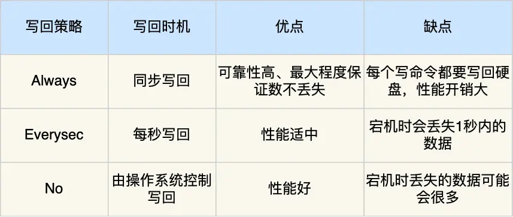

# AOF

## AOF日志

>Append only file

**Redis AOF的流程**

1. 客户端发送写命令，读命令不会改变数据库的存储，所以AOF不关注读命令。
2. 服务器端接收到读命令后，先执行写命令，更新数据库。
3. 然后记录到日志中。

**如何开启AOF**

+ 修改`redis.conf`文件，AOF持久化功能是默认不开启的。
+ AOF 日志文件其实就是普通的文本，我们可以通过 cat 命令查看里面的内容，不过里面的内容如果不知道一定的规则的话，可能会看不懂。

```shell
// redis.conf
appendonly yes // no表示关闭 yes表示开启

appendfilename "appendonly.aof" // AOF持久化文件的名称
```

**Redis命令的存储形式**

```shell
SET key value
SET name lee
// 存储形式
*3 // 表示命令和参数一共多少个，每一条都是 $ + 命令or参数 紧跟着是参数or命令的字节
$SET 
3
$name
4
$lee
3
```

**AOF方式的好处**

1. 避免额外的开销。如果执行命令和写入命令同时或者先写入命令。如果该命令的语法或者执行过程中出现了错误，则需要回滚，产生额外的开销。
2. 不会阻塞当前写操作命令的执行，因为当写操作命令执行成功后，才会将命令记录到 AOF 日志。


**AOF持久化技术的风险**

1. 执行写操作命令和记录日志是两个过程，那当 Redis 在还没来得及将命令写入到硬盘时，服务器发生宕机了，这个数据就会有丢失的风险。
2. 由于写操作命令执行成功后才记录到 AOF 日志，所以不会阻塞当前写操作命令的执行，但是可能会给「下一个」命令带来阻塞风险。因为将命令写入到日志的这个操作也是在主进程完成的（执行命令也是在主进程），也就是说这两个操作是同步的。

如果在将日志内容写入到硬盘时，服务器的硬盘的 I/O 压力太大，就会导致写硬盘的速度很慢，进而阻塞住了，也就会导致后续的命令无法执行。

## AOF三种写回策略

**Redis写回日志的过程**

1. Redis执行完命令之后，先将命令追加到`server.aof_buf`缓冲区。
2. 调用`write()`系统调用，将aof_buf缓冲区的数据写入到AOF文件中，此时数据并没有写入到硬盘，只是写入了内核缓冲区，等待内核将数据写入磁盘。
3. 具体何时将内核缓冲区的数据写入硬盘，等待内核将数据写入内核。

**Redis的三种写回策略**

```
// redis.conf
appendfsync Always | Everysec | No
```

1. **Always**，每次写完一条命令后，redis进程将内核缓冲区的数据写入磁盘。数据不会丢失，但是会影响性能。
2. **Everysec**，每一秒写入一次，由Redis进程控制。如果上一秒的写操作命令日志没有写回到硬盘，发生了宕机，这一秒内的数据自然也会丢失。
3. **No**，不由 Redis 控制写回硬盘的时机，转交给操作系统控制写回的时机，也就是每次写操作命令执行完后，先将命令写入到 AOF 文件的内核缓冲区，再由操作系统决定何时将缓冲区内容写回硬盘。**redis进程调用write系统调用进入内核态，将数据写入到内核缓冲区，然后由操作系统控制何时写入磁盘**。操作系统控制是不可知的，可能会丢失数据。

>以上三种数据都无法完美解决**主进程阻塞**和**数据丢失**

**三种写回策略如何选择**

+ 如果要高性能，就选择NO策略
+ 如果要高可靠，就选择Always策略
+ 如果允许数据丢失一点，但又想性能高，就选择Everysec策略。



